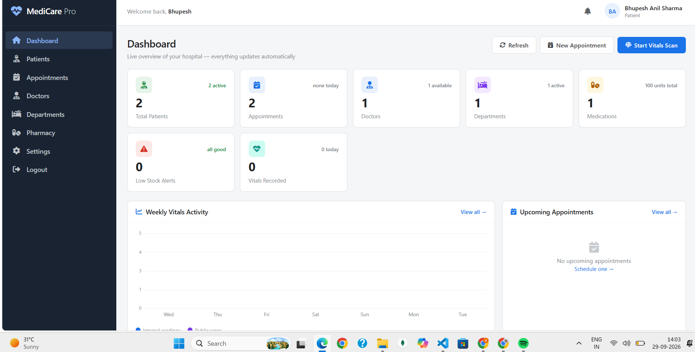
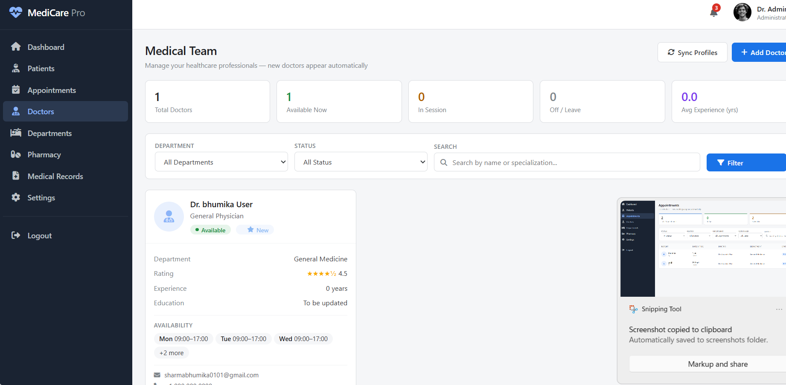
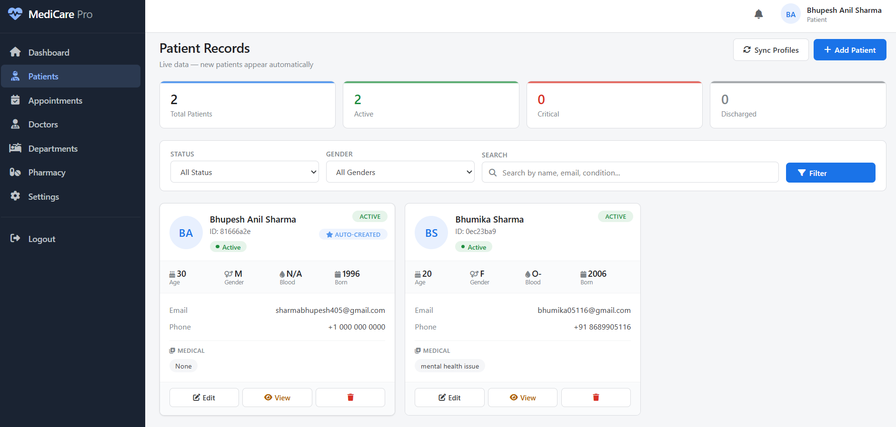
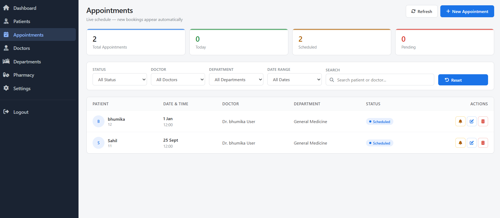
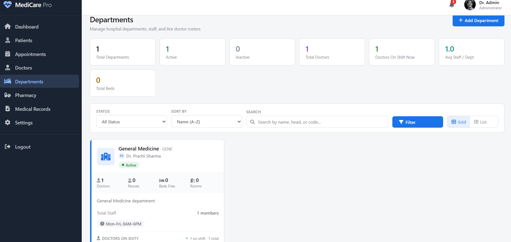
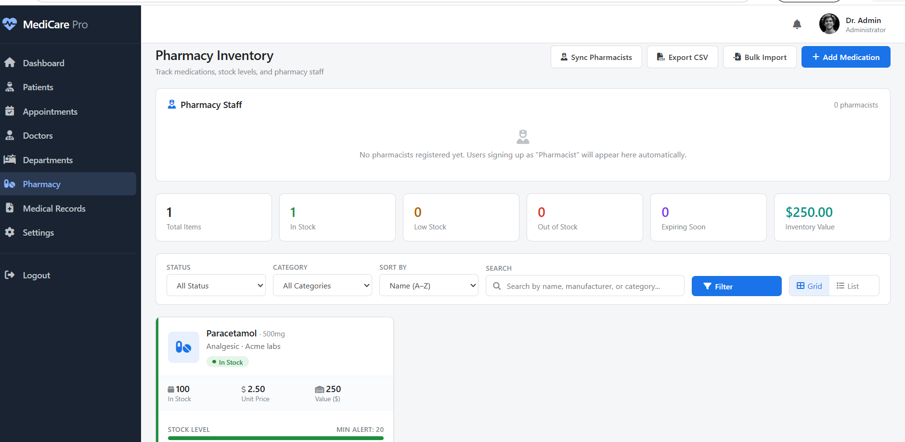

#  Medicare Pro

**Medicare Pro** is a web-based healthcare management system designed to provide a centralized platform for managing patients, doctors, appointments, departments, pharmacy services, and healthcare-related information.

The system provides a user-friendly interface for accessing healthcare services and managing healthcare information through a Node.js and Express.js backend with MongoDB database integration.

##  Features

* 👤 Patient registration and login
* 👨‍⚕️ Doctor registration and management
* 🧑‍🤝‍🧑 Doctor and patient profiles
* 📅 Appointment management
* 🏥 Department information
* 💊 Pharmacy services
* ❤️ Patient health information
* 📊 Vitals and health monitoring
* 🔐 User authentication
* 🔑 Password recovery
* 📋 Healthcare management dashboard
* 🗄️ MongoDB database integration
* 🌐 REST API integration

## 🖥️ Screenshots

### Dashboard



### Login


### Signup


### Doctors



### Patients



### Appointments



### Departments



### Pharmacy



## 🛠️ Technologies Used

| Technology       | Purpose                                    |
| ---------------- | ------------------------------------------ |
| **HTML5**        | Web page structure                         |
| **CSS3**         | User interface styling                     |
| **JavaScript**   | Frontend functionality                     |
| **Node.js**      | Backend runtime                            |
| **Express.js**   | Backend web framework and REST APIs        |
| **MongoDB**      | Database                                   |
| **Mongoose**     | MongoDB database interaction               |
| **REST API**     | Communication between frontend and backend |
| **Git & GitHub** | Version control and project hosting        |

## 📂 Project Structure

```text
Medicare_Pro/
│
├── backend/
│   ├── .env.example
│   ├── package.json
│   ├── package-lock.json
│   └── server.js
│
├── frontend/
│   ├── appointment.html
│   ├── dashboard.html
│   ├── departments.html
│   ├── doctors.html
│   ├── forgotpassword.html
│   ├── loginpg.html
│   ├── patients.html
│   ├── Pharmacy.html
│   └── vitals-scan.html
│
├── screenshots/
│   ├── Appointments.png
│   ├── Dashboard.png
│   ├── Departments.png
│   ├── Doctors.png
│   ├── Login.png
│   ├── Patients.png
│   ├── Pharmacy.png
│   ├── Pharmacy1.png
│   └── Signup.png
│
├── .gitignore
└── README.md
```

## 🚀 Installation and Setup

### 1. Clone the Repository

```bash
git clone https://github.com/sharmabhumika0101-png/Medicare_Pro.git
```

### 2. Open the Project

```bash
cd Medicare_Pro
```

### 3. Install Backend Dependencies

Navigate to the backend folder:

```bash
cd backend
```

Install the required dependencies:

```bash
npm install
```

### 4. Configure Environment Variables

Create a `.env` file inside the `backend` folder.

Use `.env.example` as a reference.

Example:

```env
PORT=5000
MONGODB_URI=your_mongodb_connection_string
```

Add any other environment variables required by the application.

> **Important:** Never upload your `.env` file, database credentials, API keys, or Google client secret files to GitHub.

### 5. Start the Backend Server

From the `backend` folder, run:

```bash
npm start
```

Or:

```bash
node server.js
```

The server will start on:

```text
http://localhost:5000
```

##  Application Pages

After starting the server, the main application pages include:

| Page         | URL                                      |
| ------------ | ---------------------------------------- |
| Dashboard    | `http://localhost:5000/dashboard.html`   |
| Login        | `http://localhost:5000/loginpg.html`     |
| Doctors      | `http://localhost:5000/doctors.html`     |
| Departments  | `http://localhost:5000/departments.html` |
| Patients     | `http://localhost:5000/patients.html`    |
| Appointments | `http://localhost:5000/appointment.html` |
| Pharmacy     | `http://localhost:5000/pharmacy.html`    |
| Vitals Scan  | `http://localhost:5000/vitals-scan.html` |

## 🔐 Security and Privacy

The following files and folders should **not** be uploaded to GitHub:

```text
node_modules/
.env
client_secret_*.json
```

These files may contain dependencies, environment variables, credentials, API keys, or other sensitive information.

The project uses `.gitignore` to prevent sensitive and unnecessary files from being tracked.

To install dependencies after cloning the project:

```bash
npm install
```

##  Application Workflow

```text
User
  ↓
Registration / Login
  ↓
Dashboard
  ↓
Healthcare Services
  ├── Doctors
  ├── Patients
  ├── Departments
  ├── Appointments
  ├── Pharmacy
  └── Vitals Monitoring
  ↓
Backend REST APIs
  ↓
MongoDB Database
```

## 🔮 Future Improvements

* Online appointment booking
* Doctor availability management
* Prescription management
* Medical report management
* Improved authentication and authorization
* Online pharmacy integration
* Email and notification services
* Enhanced patient health monitoring
* Role-based access control
* Deployment to a cloud platform

##  Project Status

**Status: Academic / Development Project**

Medicare Pro is developed as a web-based healthcare management system for academic and development purposes. The project demonstrates frontend development, backend API development, database integration, authentication, and healthcare information management.

## Author

**Bhumika Sharma**

B.Tech Data Science
Usha Mittal Institute of Technology
S.N.D.T. Women's University, Mumbai

## 📄 License

This project is developed for academic and educational purposes.
